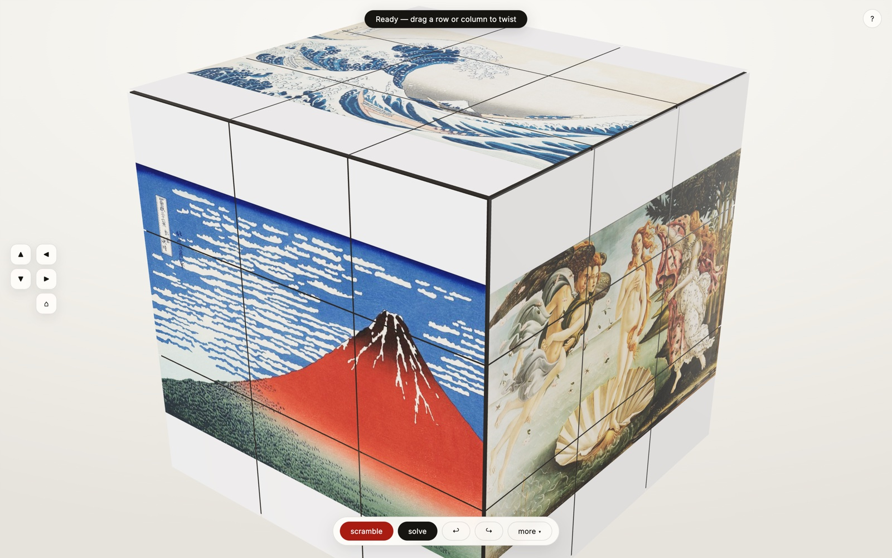
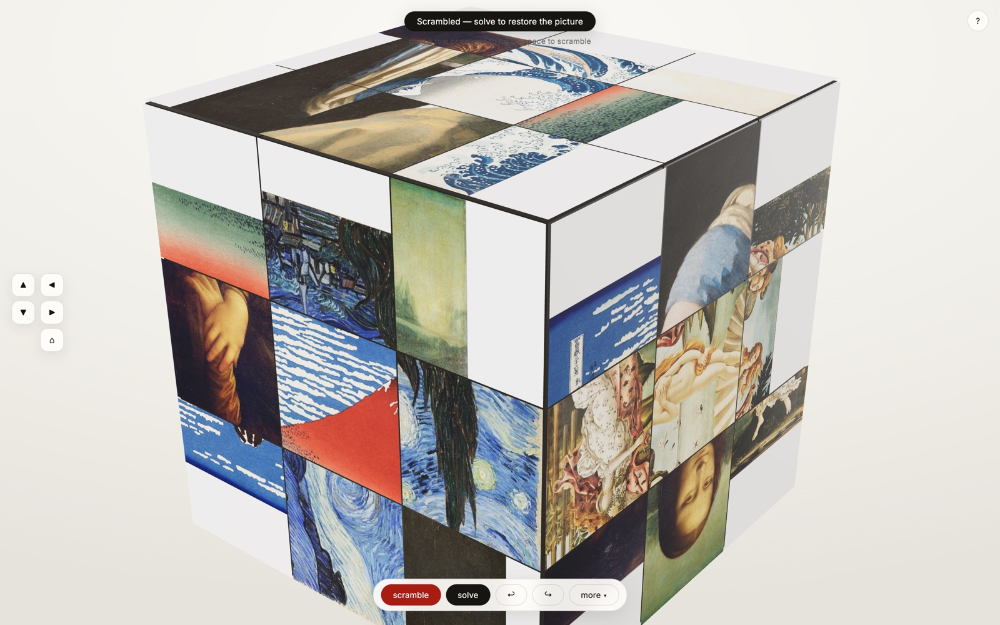

# Rupiks Cube

<p align="center">
  
</p>

<p align="center">
  <strong>A Rubik's cube made of your pictures.</strong><br>
  Put a photo on each face · twist the layers and watch the images shatter · solve it to put them back together.
</p>

---

## How it plays

1. **Pick six pictures.** The first screen is a face picker laid out like the unfolded cube — upload your own, or take six from the bundled **free starter pack** of public-domain artworks. The cube always starts blank; the pack is just a shortcut.
2. **Twist by hand.** Drag any row or column — the layer follows your finger and snaps into place. Middle rows work too. The view buttons on the left edge rotate the cube in space, so camera moves never collide with twists.
3. **Scramble & solve.** One click shatters the pictures across all 54 tiles; solve walks the cube back to the exact state your photos were placed in — or twist it back yourself. Either arrival gets confetti.

<p align="center">
  
</p>

## Controls

| Input | Action |
| --- | --- |
| drag a row / column | twist that layer (middle rows included) |
| drag empty space · wheel | orbit · zoom |
| ◀ ▶ ▲ ▼ · ⌂ (left edge) | rotate the view · reset it |
| `U D L R F B` (+`⇧`) | twist a face / twist it the other way |
| `M E S` | twist the middle slices |
| `Space` · `Enter` | scramble · solve |
| `⌘Z` / `⇧⌘Z` | undo / redo — works across scrambles |
| `more ▾` | swap a face picture, save/load, exports |

Closing the tab mid-puzzle is safe: the whole session — cube, pictures, undo
history — autosaves and restores when you come back. Puzzles can also be
shared as a **save file**, and the current tile distribution exported as an
**unfolded net** (PNG or SVG) or a view screenshot.

## The free starter pack

Twelve public-domain artworks ship in `public/demo/`, sourced from
[Wikimedia Commons](https://commons.wikimedia.org):

The Great Wave off Kanagawa & South Wind, Clear Dawn — Katsushika Hokusai ·
The Starry Night — Vincent van Gogh · The Scream — Edvard Munch ·
Mona Lisa — Leonardo da Vinci · Girl with a Pearl Earring & The Milkmaid —
Johannes Vermeer · Wanderer above the Sea of Fog — Caspar David Friedrich ·
Impression, Sunrise — Claude Monet · The Kiss — Gustav Klimt ·
The Night Watch — Rembrandt van Rijn · The Birth of Venus — Sandro Botticelli

All are in the public domain (the authors died over 70 years ago and the
works long predate modern copyright terms).

## Under the hood

```
src/
  core/        pure cube engine (no DOM, no three) — 100% test-covered
               interned 24-element rotation group · 27 moves incl. slices ·
               face↔tile transforms · history semantics · serialization
  imaging/     square compose · corner-affine face→tile blit · demo pack
  three/       SKETCHY-style lighting rig · 26 cubies + 54 sticker textures ·
               turn animator · raycast twist gesture · view tweens
  store/       Zustand single source of truth · localStorage session store
  ui/          onboarding · primary bar + drawer · confetti · help
```

Invariants enforced by the test suite (`npm test`):

- **Integer-exact orientation** — zero drift over thousands of moves.
- **P5** — face↔tile coordinates round-trip for every cell of every face
  under scrambled orientations; one `FACE_FRAME` table feeds both the math
  and the renderer (the mirrored-art bug killer).
- **P7** — random command walks (twists, paints, references) undo back to
  the exact initial state, including paints undone across later scrambles.

## Develop

```bash
npm install
npm run dev      # vite dev server
npm test         # vitest property gates
npm run build    # type-check + production build
```

The visual language follows
[SAIL0R34/etch-a-sketch](https://github.com/SAIL0R34/etch-a-sketch) — thanks
for the aesthetic north star. An earlier etch-a-sketch-line version of this
cube lives in git history.

## License

[MIT](LICENSE) © SAIL0R34. Starter-pack artworks are public domain.
